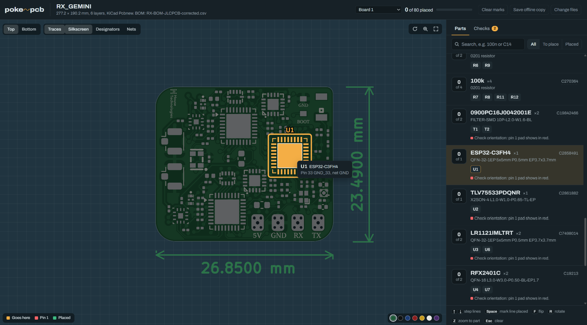

# poke~pcb


poke~pcb is an assembly map for JLCPCB boards that runs entirely in the browser. You drop in your gerbers, BOM and CPL, and it shows where every part goes. You can tick parts off as you place them, and it checks the BOM against the board.



### Demo

<video src="docs/demo.mp4" controls width="800">
  Your browser can't play this video — download it from <a href="docs/demo.mp4">docs/demo.mp4</a>.
</video>

Dropping in a board's gerbers, BOM and CPL, then locating and marking parts as placed.

## Run it

**Option 1: open the file.** Double-click `dist/poke-pcb.html`. It opens in any current Chrome, Edge, Firefox or Safari. There's nothing to install and no server is needed.

**Option 2: local server.** Use this only if your browser blocks local files.

```
cd dist
python3 -m http.server 8000
```

Then open http://localhost:8000/poke-pcb.html

**Option 3: host it.** Copy `dist/poke-pcb.html` to any static host and rename it `index.html`. GitHub Pages, Netlify or your own server all work. There's no backend, and files never leave the user's browser.

The page reaches the internet for only two things:
- **The Archivo font from Google Fonts.** Without it, the page falls back to the system font.
- **jsPDF 2.5.1 from cdnjs.** This is used only by "Download report (PDF)".

Everything else works offline.

## Use it

1. **Drop your files onto the page.** It takes the gerber zip you uploaded to JLC, or the production zip JLC sends back, plus a BOM and optionally a CPL, as CSV or XLSX.
2. **Click Open board.**
3. **Find parts.** Hover or tap a BOM line to light up its pads. Pin 1 shows in red.
4. **Mark progress.** Tap a designator to mark it placed. Progress is saved in the browser for each board.
5. **Check the BOM.** The Checks tab lists BOM problems. "Download report (PDF)" saves them as a one-page summary.
6. **Save a copy.** "Save offline copy" downloads one HTML file with the board built in, which you can share with a teammate.

| Key | Action |
|---|---|
| ↑ ↓ | step through BOM lines |
| Space | mark the line placed |
| F | flip to the other side |
| R | rotate |
| Z | zoom to the selected part |
| N | net highlight |
| 0 | fit the board |
| / | search |
| Esc | clear the selection |

## Files it accepts

**Gerbers:** a zip, a folder or loose files from KiCad, EasyEDA, Altium, Eagle or Fusion 360.
- Zips inside zips are opened, down to 3 levels.
- Files over 25 MB are skipped. These are JLC's panel CAM files.
- If there are several gerber sets, it picks the most complete one.

**Drills:** Excellon files (`.drl`, `.txt`, `.xln`).

**BOM:** CSV, TSV or XLSX.
- It needs a Designator column. Comment/Value, Footprint, LCSC and Qty columns are used if present.
- Title rows above the header are fine.

**CPL / pick-and-place:** CSV or XLSX with designator, X, Y, rotation and layer columns. Values may carry `mm` or `mil`.

**JLC order info:** `YG/*.json` inside the production zip. It sets the mask colour, silkscreen colour and surface finish.

How parts are found:
- **With pad data.** KiCad gerbers usually record which pad belongs to which part (X2 `TO.P` attributes, or the `G04 #@!` comment form). That gives exact pads, pin 1 and net names.
- **Without pad data.** Other gerbers need the CPL. Its positions are aligned to the paste pads automatically, including origin offset and Y-flip. A BOM with package sizes, such as "QFN-24 4x4mm", makes the matching more accurate.

## Change the code

```
src/
  shell.html   page markup and CSS (__SCRIPTS__ is replaced at build)
  io.js        zip reader (DecompressionStream), XLSX and CSV parsing, text decoding
  gerber.js    RS-274X/X2 parser (aperture macros, arcs, regions, polarity) and Excellon
  board.js     finds files, picks the gerber set, draws the SVG layers, locates parts, matches the BOM, runs the checks
  app.js       drop screen, board viewer, parts list, checks, PDF report, offline copy
build.py       joins src/ into dist/poke-pcb.html
tools/harness.js  runs the engine in Node for testing
```

After editing anything in `src/`, rebuild. This needs Python 3 only:

```
python3 build.py
```

To test the engine without a browser (Node 18 or newer):

```
node tools/harness.js path/to/gerbers.zip path/to/bom.csv [path/to/cpl.csv]
```

The harness prints:
- the gerber set it chose and each layer's role
- the JLC order info
- every BOM line as matched to the board
- all check results

## Known limits

- PDF BOMs and old `.xls` files can't be read. Export them as CSV or XLSX.
- Without pad data or a BOM, the CPL matching is approximate. Small parts squeezed between big ICs can pick up a neighbour's pads.
- There's no JLC rotation check yet.
- Step-and-repeat (panelized) gerbers aren't expanded.

## License

MIT — see [LICENSE](LICENSE).
